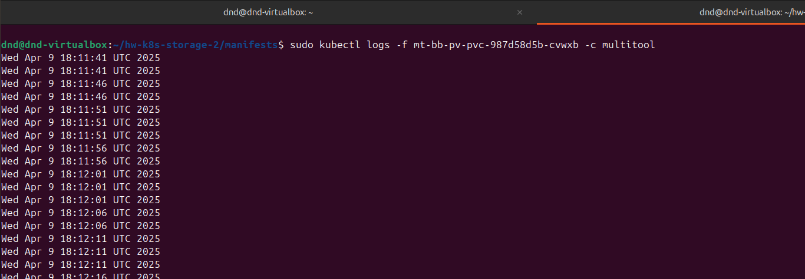

# Домашнее задание к занятию "`Хранение в K8s. Часть 2`" - `Дедюрин Денис`

---
## Задание 1

Создать **Deployment** приложения, использующего локальный **PV**, созданный вручную.

1. Создать **Deployment** приложения, состоящего из контейнеров **busybox** и **multitool**.
2. Создать **PV** и **PVC** для подключения папки на локальной ноде, которая будет использована в поде.
3. Продемонстрировать, что **multitool** может читать файл, в который **busybox** пишет каждые пять секунд в общей директории. 
4. Удалить **Deployment** и **PVC**. Продемонстрировать, что после этого произошло с **PV**. Пояснить, почему.
5. Продемонстрировать, что файл сохранился на локальном диске ноды. Удалить **PV**.  Продемонстрировать что произошло с файлом после удаления **PV**. Пояснить, почему.
5. Предоставить манифесты, а также скриншоты или вывод необходимых команд.

### Ответ:

1. Создаем манифест **Deployment** приложения, состоящего из контейнеров **busybox** и **multitool**:

**deployment.yaml**

```
apiVersion: apps/v1
kind: Deployment
metadata:
  name: mt-bb-pv-pvc
spec:
  replicas: 1
  selector:
    matchLabels:
      app: mt-bb
  template:
    metadata:
      labels:
        app: mt-bb
    spec:
      containers:
        - name: busybox
          image: busybox
          command: ["/bin/sh", "-c", "while true; do echo $(date) > /data/hello.txt; sleep 5; done"]
          volumeMounts:
            - name: data
              mountPath: /data
        - name: multitool
          image: wbitt/network-multitool
          command: ["/bin/sh", "-c", "while true; do if [ -f /data/hello.txt ]; then cat /data/hello.txt; fi; sleep 2; done"]
          volumeMounts:
            - name: data
              mountPath: /data
      volumes:
        - name: data
          persistentVolumeClaim:
            claimName: local-pvc
```

2. Создаем манифесты **PV** и **PVC** для подключения папки на локальной ноде:

**local-pv.yaml**

```
apiVersion: v1
kind: PersistentVolume
metadata:
  name: local-pv
spec:
  capacity:
    storage: 1Gi
  accessModes:
    - ReadWriteMany
  persistentVolumeReclaimPolicy: Retain
  storageClassName: local-storage
  local:
    path: /home/dnd/hw-k8s-storage-2/data
  nodeAffinity:
    required:
      nodeSelectorTerms:
        - matchExpressions:
            - key: kubernetes.io/hostname
              operator: In
              values:
                - dnd-virtualbox
```

**local-pvc.yaml**

```
apiVersion: v1
kind: PersistentVolumeClaim
metadata:
  name: local-pvc
spec:
  accessModes:
    - ReadWriteMany
  storageClassName: local-storage
  resources:
    requests:
      storage: 1Gi
```

3. Применяем все манифесты:

```
sudo kubectl apply -f local-pv.yaml
```

```
sudo kubectl apply -f local-pvc.yaml
```

```
sudo kubectl apply -f deployment.yaml
```

```
sudo kubectl get pv
```

```
sudo kubectl get pvc
```

```
sudo kubectl get deployment
```

```
sudo kubectl get pod
```


Проверяем, что **multitool** может читать файл, в который пишет **busybox**:

```
sudo kubectl logs -f mt-bb-pv-pvc-987d58d5b-cvwxb -c multitool
```



4. Удаляем **Deployment** и **PVC** и проверяем что после этого произошло с **PV**:

```
sudo kubectl delete deployment mt-bb-pv-pvc
```

```
sudo kubectl delete pvc local-pvc
```

```
sudo kubectl get pv
```


Видим, что **PV** перешёл в статус **Released**. Это значит, что **PVC** была удалена, но сам том остался. Так как в настройках указано `persistentVolumeReclaimPolicy: Retain`, **Kubernetes** не удаляет том и не трогает файлы. Данные на диске остались.

5. Проверяем, что файл сохранился на локальном диске ноды:

```
cat /home/dnd/hw-k8s-storage-2/data/hello.txt
```


Удаляем **PV** и ещё раз проверяем что произошло с файлом после удаления **PV**:

```
sudo kubectl delete pv local-pv
```

```
cat /home/dnd/hw-k8s-storage-2/data/hello.txt
```


Видим, что файл не удалился, даже после удаления **PV**.

---
## Задание 2

Создать **Deployment** приложения, которое может хранить файлы на **NFS** с динамическим созданием **PV**.

1. Включить и настроить **NFS-сервер** на **MicroK8S**.
2. Создать **Deployment** приложения состоящего из **multitool**, и подключить к нему **PV**, созданный автоматически на сервере **NFS**.
3. Продемонстрировать возможность чтения и записи файла изнутри пода. 
4. Предоставить манифесты, а также скриншоты или вывод необходимых команд.

### Ответ:


